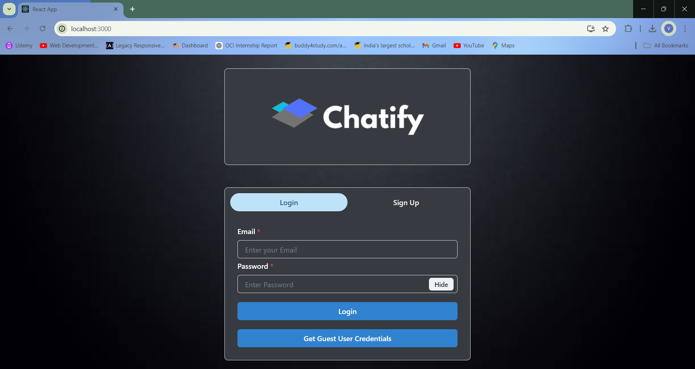
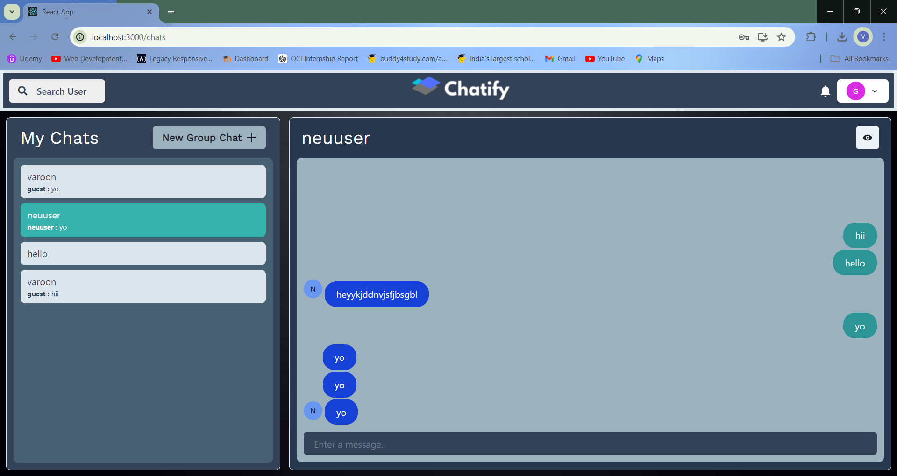

# Chatify

Chatify is a simple chat website that allows users to chat with friends and participate in group chats. This project is built using the MERN stack (MongoDB, Express, React, Node.js) and Socket.IO for real-time communication.

## Features

- User authentication and authorization
- Real-time messaging with friends and groups
- Create and manage group chats
- Receive notifications for new messages
- Search users to start a new chat

## Technologies Used

- **Frontend:** React, Chakra UI
- **Backend:** Node.js, Express
- **Database:** MongoDB
- **Real-time Communication:** Socket.IO
- **Authentication:** JSON Web Tokens (JWT)

## ScreenShots

### Login Page

### Chat Page

## Acknowledgements

- [Chakra UI](https://chakra-ui.com/)
- [Socket.IO](https://socket.io/)
- [MERN Stack](https://www.mongodb.com/mern-stack)
